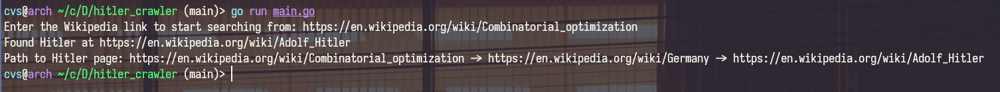

# Hitler crawler
You may know a joke that says each dialog will end with a discussion about Hitler. Let's check it. This program that receives a Wikipedia article and scans it for other Wikipedia links, opens them, and scans for links until it finds the link to Hitler Wikipedia page.
## How the program works:
- Input is a link to some Wikipedia page
- Output is the path to the Hitler page, if the page is not found in 6 hops, the program will write into the console “Hitler not found”
- Program uses a BFS-like algorithm to find the Hitler Wiki page
### Program execution example:
```sh
go run main.go
```
### Output:

